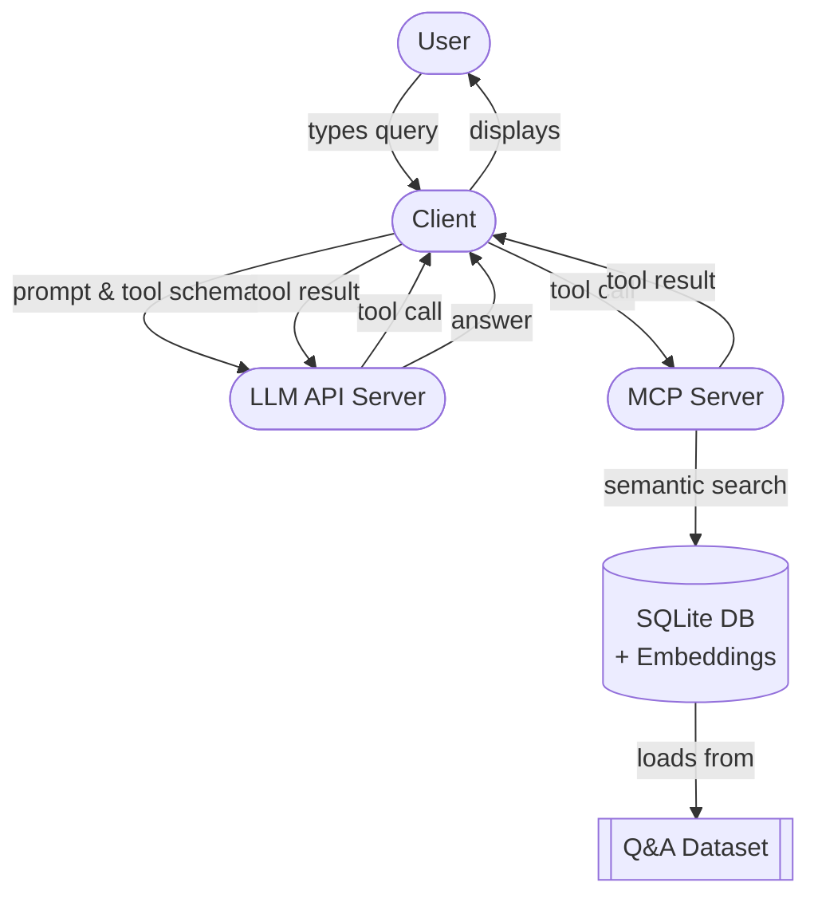

# Pre-test attempt for [LFX mentorship (2025/term2) WasmEdge](https://github.com/WasmEdge/WasmEdge/issues/4109#issue-3055274339)

## About
This is a pre-test attempt for the LFX mentorship program, specifically for the "Create an MCP-based AI agent to help LF certificate preparation" [[1]](https://github.com/WasmEdge/WasmEdge/issues/4109#issue-3055274339).

## Project Features
- **Modular design**: The project is designed to be modular, allowing for easy addition of new MCP servers and tools.
- **Semantic question search**: Rather than using traditional keyword search, the project uses semantic search to find relevant questions. This is done using the gemini's `text-embedding-004` [[2]](https://ai.google.dev/gemini-api/docs/models/gemini#text-embedding) text embedding model and `sqlite3` db with `sqlite_vec` [[3]](https://github.com/asg017/sqlite-vec) extension to store the vectors.
- **Easy model switching**: The project allows for easy switching between different models (remote & local), simply by updating the environment variables. Supports `LlamaEdge API server` [[4]](https://llamaedge.com/docs/user-guide/llm/full-openai).
- **Custom dataset**: The project uses a custom dataset of questions and answers, which is stored in a sqlite3 database. The `jsnad_qna.csv` dataset is sample dataset created for [OpenJS Node.js Application Developer (JSNAD)](https://training.linuxfoundation.org/certification/jsnad/) exam. It is copyright compliant as it is generated using frontier models.

**Goal**: To create an AI agent that can assist in preparing LF certificates using MCP (Model Context Protocol) [[5]](https://docs.anthropic.com/en/docs/agents-and-tools/mcp).

**Objective**: 
- To demonstrate the ability to create an AI agent capable of handling external tools via MCP.
- To demonstrate the understanding of topics like MCP, AI agents, and tool usage.

## Dockerized LlamaEdge Server (Optional Local LLM)

For running a local LLM with tool-calling capabilities, a pre-built Docker image for the LlamaEdge API server featuring the Meta Llama 3.2 3B Instruct model is available on Docker Hub:

-   **Docker Hub Link**: [mayureshdev/llama-3.2-3b](https://hub.docker.com/r/mayureshdev/llama-3.2-3b)

You can easily pull and run this image to start an OpenAI-compatible chat API server locally or on any machine with Docker. This server supports tool calls, enabling integration with the MCP server.

**To run the Dockerized server:**
```bash
# Pull the image
docker pull mayureshdev/llama-3.2-3b:latest

# Run the container (ensure you have sufficient RAM, ~8GB+ recommended)
docker run -d -p 8080:8080 --name llamaedge-server-3b mayureshdev/llama-3.2-3b:latest
```
The API will then be available at `http://localhost:8080`. You can configure the `LLM_API_BASE_URL` in your `.env.local` file to `http://localhost:8080/v1` and `LLM_MODEL` to `Llama-3.2-3b` (or as defined by the server) to use this local LLM.

Detailed instructions for building this and other LlamaEdge Docker images (e.g., for Llama 3.1 8B) can be found in the [`llamaedge/README.md`](./llamaedge/README.md) directory.

## Screenshots


## Architecture Diagram


## How to run
It's very simple to get things up and running. Just follow the steps below:
1. Clone the repository:
   ```bash
   git clone https://github.com/Mayuresh-22/LFX_T2_WasmEdge_MCP_Pre_Test_Attempt.git
   cd LFX_T2_WasmEdge_MCP_Pre_Test_Attempt
   ```
2. Install the required dependencies:
   ```bash
   uv venv
   .venv/Scripts/activate
   uv sync
   ```
3. Update the environment variables:
    ```bash
    Add your environment variables to the .env.local.example file
    and rename it to .env.local
    ```
4. Run the application:
    ```bash
    uv run client.py
    ```
5. Follow the instructions in the terminal to interact with the AI agent.
6. To stop the chat loop, type "exit" or "quit".

## Pre-test completion status

| Task                                                                                                                         | Status   |
|------------------------------------------------------------------------------------------------------------------------------|:--------:|
| Create a LlamaEdge API server using a tool-call enabled open-source LLM                                                      | ✅       |
| Create an MCP server that "searches" questions and answers from a text file                                                  | ✅       |
| Create a simple Python application that:                                                                                     |          |
| &nbsp;&nbsp;&nbsp;&nbsp;• takes user input                                                                                   | ✅       |
| &nbsp;&nbsp;&nbsp;&nbsp;• calls the LLM API server                                                                          | ✅       |
| &nbsp;&nbsp;&nbsp;&nbsp;• handles LLM tool calls using MCP                                                                  | ✅       |
| &nbsp;&nbsp;&nbsp;&nbsp;• sends LLM response back to the user                                                               | ✅       |
| Explain your choice of test subjects and how you plan to get the source questions and answers (must be copyright compliant)  | ✅       |

## Original Work & Licensing
This project represents my original work and effort created for the LFX Mentorship (2025/Term2) WasmEdge pre-test. This work is licensed under the [MIT License](LICENSE).

## Dataset Attribution
The `jsnad_qna.csv` dataset, used for the OpenJS Node.js Application Developer (JSNAD) exam preparation, was generated using frontier models. The generation process referenced the Node.js Official Documentation, which is available under the MIT License.
- **Node.js Official Documentation:** [https://nodejs.org/api/](https://nodejs.org/api/)

## Thank You!

Thank you for taking the time to review my pre-test submission. I’m genuinely excited about the possibility of joining the mentorship program and eager to learn, grow, and contribute.
If you have any feedback or suggestions, I’d love to hear them!

Feel free to contact me via [mayureshchoudhary22@gmail.com](mailto:mayureshchoudhary22@gmail.com) or [LinkedIn](https://www.linkedin.com/in/mayureshchoudhary/).
